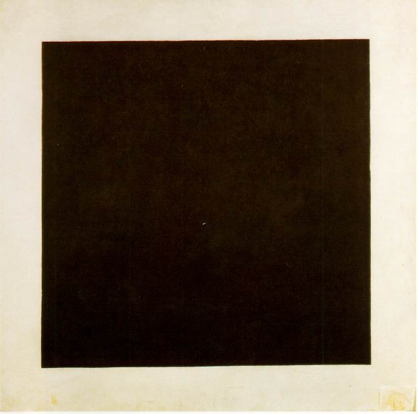

_This piece offers another perspective on the overdetermined effect elaborated [here](../sensory-overload)._

Readers of this blog are probably familiar with Csikszentmihalyi's concept of _flow_, a mental state characterized by extreme focus and productivity, which also goes by the name of the 道.

1. The terror of flow; the delight of transcendence and being.
2. Paranoia: Descartes, LessWrong, "first principles" thinking.
3. The emptiness of the subject: Girard, Hegel.
4. Hardness vs. Randomness; form and content
5. Becoming who you are or the retreat into optionality

> _What a beautiful face \
> I have found in this place \
> That is circling all 'round the sun \
> And when we meet on a cloud \
> I'll be laughing out loud \
> I'll be laughing with everyone I see \
> Can't believe how strange it is to be anything at all_
