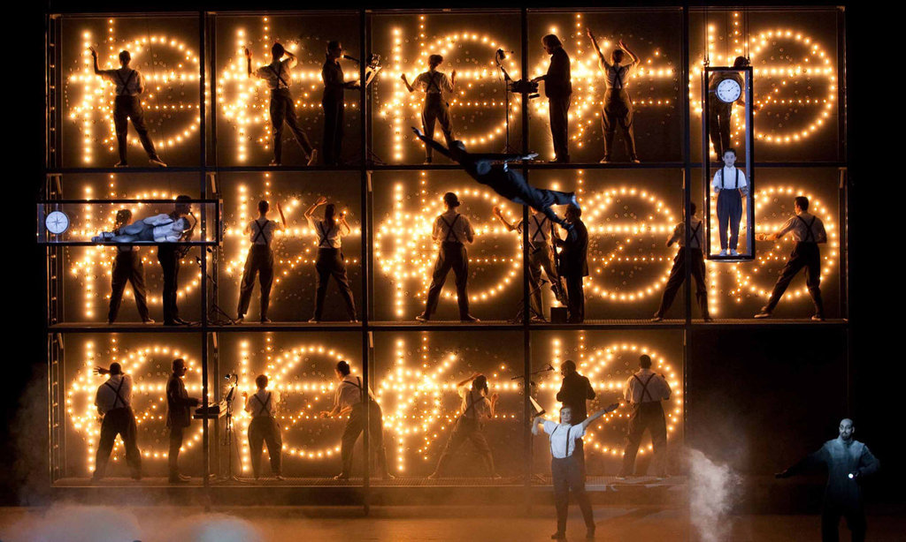

There is a part of my psyche is actively hostile to everything that it didn't create itself. To call it the _engineer_ in me would be directionally correct but essentially wrong; to call it the _autist_ in me would be marginally more accurate, if a bit beyond the pale.

A good engineer, _qua_ engineer, knows that his goals are best accomplished by carefully studying that which exists, [passively absorbing the facts and charting the path of least resistance through them](http://www.bopsecrets.org/gateway/passages/chuang-tzu.htm).

Autism, on the other hand, inhibits this. By _autism_ I refer to a condition where the facts present themselves as an unbearable jumble of unpleasant stimuli. To the autist, "passive absorption" of these facts is itself a profoundly irritating and exhausting experience. How tiresome to learn new facts, absorb new information; all the more if there are a great many facts to learn. But regardless of whether by fault of Self or Other, it's generally the case that the more irritating it is for one to adapt to reality, the more one is compelled to reject their given reality and substitute their own.[^hist]

A tendency toward autism is what drives the engineer toward engineering in the first place. Autism delivers a constant, throbbing world-pain that demands resolution. In the case of software [^1], it demands that he learn to code — to segment the chaotic mass of human behavior into clean, binary oppositions, _if_ on one hand and _else_ on the other. Software is a means of devouring the horrible manifold Other and transforming it into the unified Self, all from the safety of monospaced characters in a text editor. And the removal of the pain by means of code, the clearing-away of the obstacles impinging the mind, brings with it a certain joy.

It's a tragedy that his autism also inhibits him from being the best engineer that he can be. Everywhere we see the same story: the archetypal engineer wastes so much time rebuilding or re-implementing perfectly fine systems because these systems are, or have become, part of the Other. Perhaps they are built with technologies he doesn't want to learn. Perhaps they have grown complicated, to the point where the system itself is a hassle to grasp. Perhaps other systems exist with which they have not been integrated. In any case, many engineers, when left to their own devices, would be caught in an endless cycle of Othering their tools and devouring them again[^xkcd].

{: height="240px" width="240px"}

These foibles are well-known, and are typically ascribed to _the way engineers are_. But they are not this way by virtue of being engineers; they are this way by virtue of what made them engineers in the first place. Granted, the impulses I'm describing aren't completely universal. It is possible for an engineer to be motivated by something other than an overmastering impulse to devour the unknown without having to know it. But he is probably not — what's the word again? — an [animal](http://www.paulgraham.com/start.html).

It is telling that most engineering managers stumble into their jobs out of accident or necessity rather than by desire. When I was working at Google, the manager of my team told me a story that wasn't uncommon at all — that he had once been an engineer himself, that he wishes he were an engineer still, and that what prompted his unpleasant transition to management was that _nobody else on his team could do it right_.

The necessity of actually getting things done, enforced by the provision of one's paycheck, compels a certain few to abandon the safety of the text editor and to take on the task of synthesizing large amounts of knowledge to inform decisions about where an engineer's effort is best applied. This is engineering management.

Plato makes the point[^plato] that the just city should be ruled by philosopher-kings produced in the following manner: that they be educated to become soldiers, then left alone to become philosophers, then forced to become kings. Philosophers, though most deserving to rule, desire to rule the least; they see the truth behind all things, and must be coerced into paying attention to the things rather than the truth.

An engineer faces the same bind. To properly fulfill his role as an engineer, he must become a manager. He must act against his instinct, subordinating it to the good of the organization — or, to perfect the Platonic parallel, his own soul. He must turn away from the undifferentiated One of his codebase to the intractable Many at the heart of existence. (Of course, he is adequately compensated.)

---

Near the end of my summer at Google, I noticed that I was becoming unable to read. I don't mean by this that I'd acquired a kind of mild dyslexia. I could still understand the content of, say, a sentence or a paragraph. I mean that I suddenly became acutely aware that my short-term memory was not up to the task of comprehending long and densely connected texts. I'd had up-close experiences of neurodegenerative disease in close family members, and I was quite anxious about whether I was already past my cognitive peak at the relatively young age of twenty-one.

Or maybe I'd always been like this, and it was just this particular text[^strauss] that was drawing out. This was a more unsettling conclusion. When I thought about it, I realized that my closest friends all seemed to have some variation of this problem. They all seemed to be somewhat absent-minded and forgetful, and to make up for this trait by being oddly good at recognizing patterns and inventing abstractions. Why were so many of them math majors, anyway?

I became suspicious that we were experiencing [the Ireneo Funes story](https://www.literatura.us/borges/funes.html) in reverse — that we had a weak memory, and that our world was rich in concepts and abstractions precisely because we experienced reality through a smaller window than others did. Maybe we got along so well because we made one another feel like it was fine to be fucked up.

One afternoon I brought the subject up with one of these friends. I described to him the worst-case scenario I'd imagined, and my anxieties about cognitive decline. But he disagreed with my interpretation of the facts. Instead, he was of the opinion that the real issue was all the coding I'd been doing. He'd experienced the same problem himself, he said; it was easy to get carried away. But a long break typically helps; reading, despite everything, definitely helps; and maybe also some quality time spent outdoors.

He was right, of course, though I didn't yet know how to articulate why.

---

[^1]: I focus on the case of software because it is in software that this reality-substitution is quickest and easiest.
[^plato]: _Republic_ 498a-500c.
[^strauss]: Strauss's _City and Man_, whose form and content both put particular emphasis on an intelligent reader's memory and ability to parse difficult texts...
[^hist]: The autistic viewpoint has been generally influential in intellectual history. It produced concepts like [henosis](https://en.wikipedia.org/wiki/Henosis), [_dukkha_](https://en.wikipedia.org/wiki/Du%E1%B8%A5kha), and [spoons](https://en.wikipedia.org/wiki/Spoon_theory) in the intellectual traditions of Platonism, Buddhism, and Tumblrism, respectively. It underlies [Occam's Razor](https://en.wikipedia.org/wiki/Occam's_razor), especially its probabilistic formulations. It is reflected in this site's favicon, the circled dot (☉), representing the sun but also [monism](<https://en.wikipedia.org/wiki/Monad_(philosophy)>). And it is the basis of Deleuze's formalization of Nietzsche's concept of _ressentiment_.
[^xkcd]: See also [xkcd #927](https://xkcd.com/927/).
