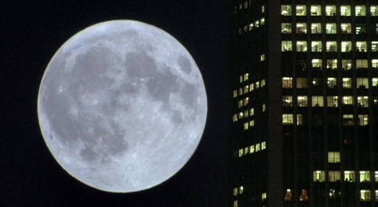

Here are several facts.

- Last week, the Senate passed a $2T stimulus package with effectively bipartisan support, some partisan posturing notwithstanding. The passage of this bill was considerably less controversial than the passage of the 2009 stimulus bill, which cost \$800B.
- Besides economists and bitcoiners, few see inflation or debt as a problem anymore. In fact, younger Americans may see more to gain in inflation than to lose, because they have few savings and massive student loans. MMT is more or less the official economic position of the Democratic Party's progressive wing.
- There is a growing skepticism in capital's ability to facilitate an efficient division of labor, or in the ability of large corporations to serve the public good. On both sides of the aisle, Trump's refusal to invoke the Defense Production Act was condemned; moreover, the CARES act provides for the Treasury absorbing an equity stake in the airlines it bails out.
- Our global supply chains are gummed up for a number of reasons. Consider the example of drugs. It was already clear a few weeks ago that the offshoring of our drug supply chain to India was going to be a major problem. Now there's a drug shortage in the US, exacerbated by an ongoing restriction by India on the export of certain pharmaceutical ingredients and the lockdown in that country. Of course, each country makes provisions in its lockdown for coronavirus-related industries to keep functioning. But there is nowhere a surplus, and international freight has essentially been repurposed solely for the delivery of medical supplies. The story is the same for hospital equipment. China is among the countries that have restricted their exports of masks and other protective equipment to serve domestic needs first. It's become clear that most countries have no problem suddenly restricting their exports, for purposes of war or plague. It is the sovereign, not the supply chain, that decides on the exception.
- In a moment of international crisis, the popularity of the president tends to surge — the "rally-'round-the-flag" effect. Trump has seen a slightly underwhelming bump from this (he's now at what, 45%?) but it's the highest since he was elected.

Here are several opinions.

- If Yang had campaigned explicitly on antagonizing China, or — conversely — if Warren were a man, he would probably be winning right now. But it is unclear that the nation views Biden to be up to the task; in the national consciousness and perhaps in his own, he is a static image of 2008, or some depoliticized ideal thereof.
- Buyback restrictions and the denial of bailouts to offshore cruise companies suggest that the government is taking a more hands-on role in forcing corporations to hew to the national line. Unlike in 2009, when unemployment was caused by intangible cataclysms in the financial markets, 2020 has seen rapid and insurmountable material changes to the lives of billions, and the dependence of corporations on the government has been even more obvious. I see a growing bipartisan movement towards undoing the 80s and re-subordinating corporations to the interests of the state.
- If America's industrial base is ever to be restored, it will happen in the coming years.

On the last point, we see the convergence of several short-, medium-, and long-term influences, all of which are exacerbated in the current situation:

- politically expedient, publicly expressed negativity towards the People's Republic of China (short-term). In particular,
  - low-quality imported products
  - labor costs that undercut domestic industry and lead to the offshoring of manufacturing technology
  - one-sided, protectionist trade policies
  - alienating, totalitarian social institutions
  - disgust with the perceived cultural habits of the Chinese people
- mass unemployment (short-term)
- a clear demonstration of the fragility of US supply chains for masks and essential medical equipment (short-term)
- a slow building-up of the US government's economic powers on a scale unprecedented since WWII (medium-term)
- frustration with neoliberalism and the mainstreaming of credible alternatives (long-term)
- frustration with the alienation inherent in the globalized service economy (long-term)
- geopolitical anxieties about the disintegration of American hegemony (long-term)
- the prolonged absence of a national purpose post-1970 (long-term)

With that in mind, here is how things might go down:

- Unemployment will worsen in the coming weeks. This being an election season, and our stimulus checks being still weeks away, the Trump administration will be pressured into making a dramatic demonstration of strength and efficacy.
- The administration's response will include a temporary jobs program, with some elements of the Green New Deal to appease Democrats. By the end of the month, it will be clear that the scale of this jobs program will need to be enormous.
- Biden will lose the election to Trump.
- As the crisis itself eases and quality of life returns to normal, the program will be accompanied by a heavier protectionism than before, to act on the political impetus to repatriate supply chains and to ensure that Americans continue to have jobs past the end of the jobs program. We may see government taking a direct role buying equity in corporations, a more palatable version of the Solyndra-style loan guarantees of 2009.
- At the same time, the massively increased spending will generate the political will for heavier and more effective taxation of multinational corporations. This is a bipartisan issue; the left would like to punish corporations, and the right would like to punish multinationals. The existing hyper-concentration of global talent in the US (and, to a lesser extent, China), combined with new protectionist policies, means that these increased taxes will not result in movements of capital out of the US at a rate as large as proponents of "tax competition" may predict.
- Finally, we may see some continued fragmentation of the West based on which countries still are and are not willing to trade with China.

Very little of what I have said here is new. All I have done is taken where things have moved over the last few weeks and extrapolated one step further. I might have overestimated the extent to which the situation is popularly understood as a failure of capitalism, or to which the average American citizen is able to understand and advocate for alternatives to the liberal consensus, or to which the baby boomers have lost their credibility in the past three months. But if I'm wrong, nothing will happen — there's nothing to lose. And if I'm right...
