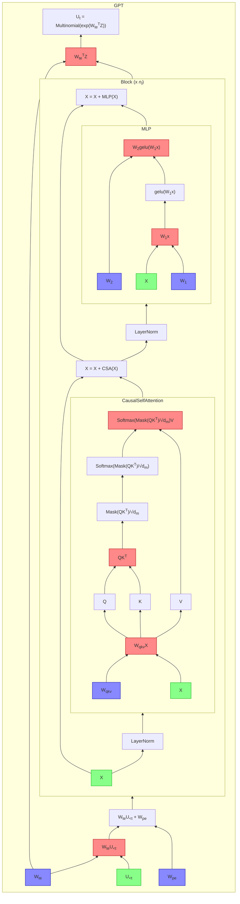
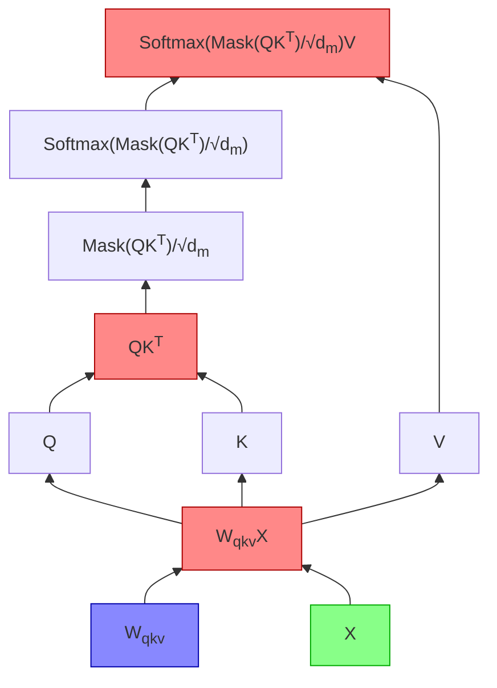
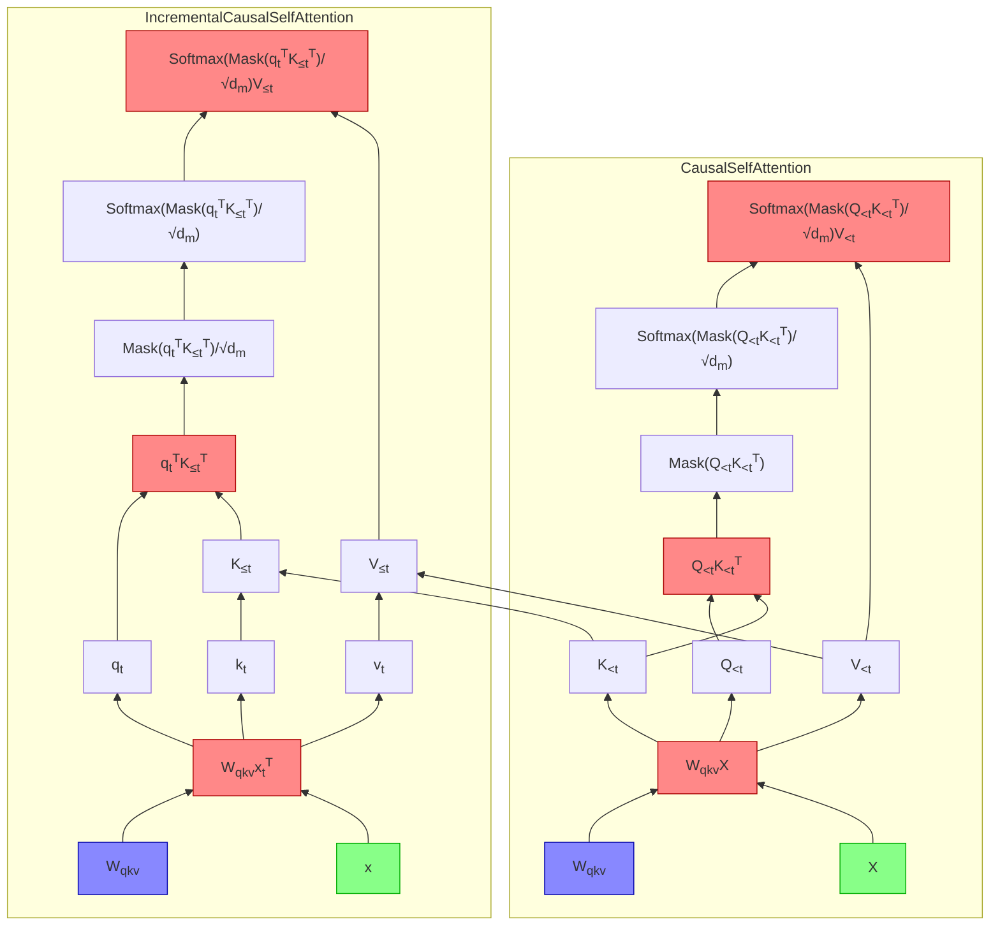

_This document is a work in progress.
While structured as an explanatory article,
it's mostly a log of research projects I undertake in my spare time.
Sections may appear or disappear randomly.
Proceed with caution._



I have often wondered what I would buy if I found myself in possession of a massive fortune.
It's often said that money is a means to an end, not an end in itself.
But in modern capitalism, to become wealthy by tasteful means
is the most comfortable proof of intellectual virtue.
As a lover of virtue, comfort, and taste,
I spend my days scheming shamelessly to secure the bag,
and only in idle moments imagine how it might actually be spent:
a La Marzocco GS/3 espresso machine, perhaps, or a bronze _ding_ cauldron
from the Shang dynasty.

My Nvidia GeForce RTX 4090,
which I purchased on a whim last week at a 25% markup over MSRP,
is a bit like the _ding_.
If I were a gamer, it might have been more like the espresso machine, _i.e._
a capital expenditure
which would be economically justified if I pulled myself
used it every day for the rest of my life.
But I dislike video games;
I prefer going outside and touching grass (and drinking espresso).
So the card's only real uses are rendering desktop windows
and deep learning.
Unfortunately, for the same present value, at a 5% discount rate,
I can run a comparable datacenter GPU continuously for four thousand hours on the Lambda cloud,
which is about as much time as it would require for Huang's law to
make a complete farce out of my purchase.
There really is no economic justification.

Still, I will not back down.
There is just something about the 4090.
The unrivaled hegemon of all consumer graphics cards,
patterned all over with a fractalized _taotie_ of tensor cores,
clearly resembles an ancient ritual cauldron more than
than it does some hipster Italian pressure cooker.
Like the _ding_,
it is a weighty symbol of primeval domination.
What other reason should I need to buy one?

So around the card I build an AMD workstation.
I set up Kubuntu and replicate my Mac setup's tangle of keyboard shortcuts.
I install `zsh` and `piper` and `kitty`.
I forward port 22 from my router and configure Wake-on-LAN.
Finally, the _pièce de résistance_ — a keyboard shortcut for typing the em dash.
So how big is this _ding_, anyway?[^ding]


I recently purchased an RTX 4090 GPU.
Frankly, I'm not sure why I did this,
because for most of my personal and professional computing needs
I'm perfectly satisfied with my M1 Macbook Pro,
and I don't really enjoy playing video games.
If all I wanted was to mess around with deep models, I'd have been better served
running a VM on the Lambda cloud, where for the same amount of money
one can run a 4090-equivalent datacenter GPU for almost a year — enough time,
I expect, for something even better to come out.

Still, one must justify the unjustifiable.
I've always been interested in ML inference at the systems level,
and owning a GPU is a good way to act on that interest.
So for the past week, on the advice of my friend [Horace He](https://horace.io/),
I've been spending my leisure time getting my hands dirty
accelerating the inference of a basic GPT model.

I chose to begin with Andrej Karpathy's
[nanoGPT](https://github.com/karpathy/nanoGPT),
which is a concise but complete implementation of the GPT model.
Within nanoGPT, the model is decomposed into the following PyTorch modules:

- `GPT`, containing
  - token `Embedding`s $$W_{te} \in \mathbb{R}^{d_m \times (n_v = 50257)}$$
  - positional `Embedding`s $$W_{pe} \in \mathbb{R}^{d_m \times (n_b = 2048)}$$
  - a `Dropout` layer, applied to the input embedding $$W_{te}U + W_{pe}$$.
  - $$n_\ell$$ `Block`s.
  - a final `Linear` layer with parameter $$W_{te}^T$$.
  - logic for pulling released GPT-2 weights via Huggingface and performing autoregressive sampling.
  - global configurations for dropout,
    and whether to include biases on certain layers (denoted with [brackets] below).
- `Block,` containing:
  - a residual block of:
    - a `LayerNorm`.
    - a `CausalSelfAttention`.
  - another residual block of:
    - a `LayerNorm`.
    - an `MLP`.
- `CausalSelfAttention`, containing:
  - a `Linear` layer with parameter $$W \in \mathbb{R}^{3d_n [+1]\times d_n}$$. - this layer is split into three, and should be considered $$(\begin{smallmatrix}W_Q & W_K & W_V & [b]\end{smallmatrix})$$[^wxb].
  - a `Dropout` layer, which is applied to the attention matrix $$QK^T$$.
  - a `Linear` layer with parameter $$W \in \mathbb{R}^{d_n\times d_n [+1]}$$.
  - another `Dropout` layer, applied to the output.
- `MLP`, containing:
  - a `Linear` layer with parameter $$W \in \mathbb{R}^{4d_n \times d_n [+1]}$$.
  - a GELU activation.
  - a `Linear` layer with parameter $$W \in \mathbb{R}^{d_n \times 4d_n [+1]}$$.
  - a `Dropout` layer applied to the output.
- `LayerNorm`, a LayerNorm implementation that allows bias to be switched [on] and off.

For more details on this architecture pray consult [the previous post](/2023/01/22/transformers.html).

[^wxb]:
    Note that I follow the convention
    $$y = W(\begin{smallmatrix}x \\ [1]\end{smallmatrix})$$
    rather than $$y = xW + b$$.

My plan
is to rewrite these modules gradually, specifically to accelerate inference rather than training.
To guide this project and measure its success, I need a fixed benchmark.
I propose the following:

- We define executing a _task_ as reading an input of 256 tokens,
  which represents a uniformly sampled substring from Moby Dick[^melville],
  and sampling another 256 tokens, prompted by the initial 256, from the model `gpt2-xl`,
  which has 1.5 billion parameters.
- We measure an implementation of the GPT model by the throughput of tasks it can execute.
  We may choose to fix a large number of tasks (_e.g._ $$N = 1000$$) and
  measure how quickly a script can execute all of them.

A reasonable ansatz is that the distribution of the time this task takes
is approximately normal, so we can defer the question about sample sizes to later.
In a file called `harness.py` we write something like:

[^melville]:
    The UTF-8 edition from Project Gutenberg has 305k tokens if we strip out
    the metadata, the leading spaces, and the intra-paragraph newlines.
    The newline transformation is critical; we need to format the book to resemble
    OpenWebText data to get the best results.

```python
def benchmark(
    gpt: GPT,
    batch_size=1,
    sample_size=1
) -> float:
    return [
        sample(
            gpt,
            batch_size,
            prompt_tokens=256,
            sampled_tokens=256
        )
        for _ in tqdm(range(sample_size))
    ]


def sample(
    gpt: GPT,
    batch_size=1,
    prompt_tokens=256,
    sampled_tokens=256,
    get_rand_input=get_rand_input,
) -> float:
    start = torch.cuda.Event(enable_timing=True)
    end = torch.cuda.Event(enable_timing=True)
    u = get_rand_input(batch_size, prompt_tokens)
    cuda_u = torch.from_numpy(u).cuda()

    # run inference
    torch.cuda.synchronize()
    start.record()
    idx = gpt.generate(cuda_u, sampled_tokens)
    end.record()
    torch.cuda.synchronize()

    # visualize outputs
    idx = idx.to("cpu").numpy()
    for i in range(batch_size):
        print(
            decode(u[i]),
            "🩹",
            decode(idx[i][len(u[i]) :])
        )
    return start.elapsed_time(end) / 1e3


def get_rand_input(batch_size, seq_len):
    md_tokens = get_moby_dick_tokens() # memoized
    md_len = len(md_tokens)
    return np.array(
        [
            md_tokens[start_idx : start_idx + seq_len]
            for start_idx in (
                random.randint(0, md_len - seq_len)
                for _ in range(batch_size)
            )
        ]
    )
```

When I run the full version of this code on `gpt2-xl` with a prompt length of just 128,
the GPU issues forth a long croak of coil whine,
and spits out:

```
loading weights from pretrained gpt: gpt2-xl
number of parameters: 1557.61M
Moby Dick has 305318 tokens

== SAMPLED TEXT FOLLOWS ==

 on her way north-eastward towards the island of Java;
 a gentle air impelling her keel, so that in the surro
unding serenity her three tall tapering masts mildly w
aved to that languid breeze, as three mild palms on a
plain. And still, at wide intervals in the silvery nig
ht, the lonely, alluring jet would be seen.

But one transparent blue morning, when a stillness alm
ost preternatural spread over the sea, however unatten
ded with any stagnant calm; when the long burnished su
n-glade on the waters seemed a golden finger laid acro
ss them, enjoining some secrecy 🩹 and secrecy it did
not admit of; when those spectacles of azure were star
ing through the panes, without the least bloodlust, ar
ound her passing from star to oar, which she could mee
t as those she ran, visible to him; her lewness of her
 shiny of sea-silken've is never mentioned by any, sav
 e in some tenth case; And, after thus maintaining a r
 emote silence at anchor, on daybreak she appears to r
 eason on the outside!

At an instant, as she adjusts her masts, the deserted
hulk of a powerful ship pierces her leeward. Huge colu
mns of

== END OF SAMPLED TEXT ==

time: 11.12s
```

Too late do I now realize that I chose the wrong text with which to test model correctness.
It is, unfortunately, well within the realm of possibility for Melville to have written of the Pequod's
_lew shiny of sea-silken've_ —
but even if correctness is indistinguishable from gibberish,
we can be assured that any subsequent implementations of the model are correct
as long as their final activations match nanoGPT's.

---

#### Surface observations about bottlenecks

A glance at `nvtop` gives us the story on the inference above:


First, memory usage climbs to 6 GiB.
Once the model is loaded, the GPU's utilization shoots up to 99%.
Then, once inference is finished, 11.12 seconds later,
it drops back down to zero.

It's reasonable to assume that we're compute-bottlenecked right now,
because `nvidia-smi` is telling us that that GPU utilization is at 99%
and we have plenty of memory to spare.
After all,
1557.61M parameters of four bytes each makes 5.8 GiB,
which explains the memory utilization figure.
Doubling the batch size more or less doubles the time that inference takes,
suggesting that a single example already requires too many FLOPs to vectorize appropriately.

To figure out where we can squeeze out more compute efficiency,
then, let's review the GPT architecture.
In the diagram below, which I've lovingly rendered with a modded-out implementation
of [mermaid](https://github.com/mermaid-js/mermaid),
inputs are marked in green,
parameters are marked in blue,
matmuls are marked in red,
and the output of a module is its unique topmost value.



We care about matmuls here because all of the other nodes in the computation graph
take $$O(mn)$$ FLOPs,
while naïve matrix multiplication
$$\mathbb{R}^{m\times n} \times \mathbb{R}^{n \times p} \rightarrow \mathbb{R}^{m \times p}$$
takes $$2mnp = O(mnp)$$ FLOPs[^2mnp], which heuristically suggests that they should account for the largest share.

[^2mnp]: Half are multiplications, the other half are additions.

Here are our five matmuls, with $$t$$ being the sequence length
and all other variables as they are in [the previous post](https://www.ericjwang.com/2023/01/22/transformers.html):

- $$W_{te}U_{<t}$$, which is not really a matmul in the first place because $$U$$ is one-hot,
  and can be implemented without FLOPs;
- $$n_\ell$$ instances of $$W_{qkv}X: \mathbb{R}^{t \times (3d_m \times d_m)} \times \mathbb{R}^{t \times (d_m \times 1)} \rightarrow \mathbb{R}^{t \times (3d_m \times 1)}$$,
  - in total, about[^b] $$6 n_\ell td_m^2$$ FLOPs;
- $$n_\ell$$ instances of $$QK^T: \mathbb{R}^{t \times d_m} \times \mathbb{R}^{d_m \times t} \rightarrow \mathbb{R}^{t \times t}$$,
  - in total $$2n_\ell t^2d_m$$ FLOPs;
- $$n_\ell$$ instances of $$\text{Softmax}(\text{Mask}(\frac{QK^T}{\sqrt{d_m}}))V: \mathbb{R}^{t \times t} \times \mathbb{R}^{t \times d_m} \rightarrow \mathbb{R}^{t \times d_m}$$,
  - in total $$2 n_\ell t^2d_m$$ FLOPs;
- $$W_1x : \mathbb{R}^{1 \times (4d_m \times d_m)} \times \mathbb{R}^{t \times (d_m \times 1)} \rightarrow \mathbb{R}^{t \times (4d_m \times 1)}$$,
  - about $$8td_m^2$$ FLOPs;
- $$W_2(\text{GELU}(W_1x)) : \mathbb{R}^{1 \times (4d_m \times d_m)} \times \mathbb{R}^{t \times (d_m \times 1)} \rightarrow \mathbb{R}^{t \times (4d_m \times 1)}$$,
  - about $$8td_m^2$$ FLOPs;
- $$W_{te}^T Z : \mathbb{R}^{1 \times (n_v \times d_m)} \times \mathbb{R}^{t \times (d_m \times 1)} \rightarrow \mathbb{R}^{t \times (n_v \times 1)}$$,
  - $$tn_vd_m$$ FLOPs.

The FLOP requirement of a single forward pass due to matmuls is therefore approximately

$$F(t) = 6n_\ell td_m^2 + 4n_\ell t^2 d_m + 16td_m^2 + 2tn_vd_m.$$

The XL model has $$n_\ell = 48, d_m = 1600, n_v=50257$$,
so our polynomial simplifies to

$$F(t) = (3.1\times10^5)t + (9.4\times10^8)t^2.$$

Here are some values of this function:

| $$t$$    | $$(3.1\times10^5)t$$   | $$(9.4\times10^8)t^2$$ | $$F(t)$$               |
| -------- | ---------------------- | ---------------------- | ---------------------- |
| $$256$$  | $$2.4 \times 10^{11}$$ | $$2.0 \times 10^{10}$$ | $$2.4 \times 10^{11}$$ |
| $$512$$  | $$4.8 \times 10^{11}$$ | $$8.0 \times 10^{10}$$ | $$5.6 \times 10^{11}$$ |
| $$1024$$ | $$9.6 \times 10^{11}$$ | $$3.2 \times 10^{11}$$ | $$1.3 \times 10^{12}$$ |

We see that forward passes tend to take several hundred gigaflops.

Because the nanoGPT autoregressive sampling code evaluates the forward pass for $$256 \leq t < 512$$,
the entire model should take at least $$\sum_{t = 256}^{511} F(t) \approx 1.04 \times 10^{14}$$ FLOPs,
or 104 TFLOPs. (The RTX 4090 spec says it has a peak FP32 TFLOPS of 82.6 on the boost clock,
but I won't even pretend I'm using the GPU anywhere near optimally yet.)

This suggests our first optimization —
an easy one at the algorithmic level, which requires little knowledge
of how the hardware works but slashes the FLOP complexity from $$\Theta(n^3)$$ to $$\Theta(n^2)$$.

---

[^b]: I haven't included the bias because I'm lazy.

#### Day 1: Memoizing Causal Self-Attention (KV caching)

It is often said of causal self-attention that "later tokens in a sequence
do not affect the embeddings of earlier ones."
In more concrete terms: if we let the output of the `CausalSelfAttention` block
be the matrix $$A = \{a_{ij}\} \in \mathbb{R}^{t \times d_m}$$,
we can compute each entry $$a_{ij}$$ using just the values in
$$X_{\leq i}\in \mathbb{R}^{i \times d_m}$$.

It is enlightening to examine why this is the case.
Below is the architecture of causal self-attention:



Imagine passing in the two matrices $$X_{<t} = \left(\begin{smallmatrix}x_1^T \\ \vdots \\ x_{t - 1}^T \end{smallmatrix}\right) \in \mathbb{R}^{(t - 1) \times d_m}$$
and $$X_{\leq t} = \left(\begin{smallmatrix}X_{<t} \\ x_{t}^T \end{smallmatrix}\right)\in \mathbb{R}^{t \times d_m}$$.
How does each node on the graph differ?

- $$Q_{\leq t} = \left(\begin{matrix}Q_{<t} \\ q_t^T \end{matrix}\right)$$, where $$q_t = W_q x_t$$
- $$K_{\leq t} = \left(\begin{matrix}K_{<t} \\ k_t^T \end{matrix}\right)$$, where $$k_t = W_k x_t$$
- $$V_{\leq t} = \left(\begin{matrix}V_{<t} \\ v_t^T \end{matrix}\right)$$, where $$k_t = W_v x_t$$
- $$
  Q_{\leq t}K_{\leq t}^T
  = \left(\begin{matrix}Q_{<t} \\ q_t^T \end{matrix}\right) \left(\begin{matrix}K_{<t}^T & k_t \end{matrix}\right)
  $$
  $$
  = \left(\begin{matrix}Q_{<t}K_{<t}^T & Q_{<t} k_t \\ q_{t}K_{<t}^T & q_t^T k_t^T \end{matrix}\right)
  = \left(\begin{matrix}\begin{matrix}Q_{<t}K_{<t}^T & q_{t} k_t\end{matrix} \\ q_{t}^T K_{\leq t}^T \end{matrix}\right)
  $$
- $$\frac{1}{\sqrt{d_m}}\mathrm{Mask}(Q_{\leq t}K_{\leq t}^T) = \frac{1}{\sqrt{d_m}}\left(\begin{matrix}\begin{matrix}\mathrm{Mask}(Q_{<t}K_{<t}^T) & - \vec{\infty} \end{matrix} \\ q_{t}^T K_{\leq t}^T \end{matrix}\right)$$
  ,
  - where the final $$-\vec\infty$$ represents a column of $$t - 1$$ masked entries;
- $$
  \mathrm{Softmax}\left(d^{-1/2}_m \mathrm{Mask}(Q_{\leq t}K_{\leq t})^T\right)
  $$
  $$
  = \left(\begin{matrix}\begin{matrix}\mathrm{Softmax}(d^{-1/2}_m \mathrm{Mask}(Q_{<t}K_{<t}^T)) & \vec{0} \end{matrix} \\ \mathrm{Softmax}(d^{-1/2}_mq_{t}^T K_{\leq t}^T) \end{matrix} \right)
  $$
- $$
  \mathrm{Attn}(X_{\leq t}) \\
  $$
  $$
    \triangleq \mathrm{Softmax}\left(d^{-1/2}_m \mathrm{Mask}(Q_{\leq t}K_{\leq t}^T)\right)V_{\leq t}
  $$
  $$
  = \left(\begin{matrix}\begin{matrix}\mathrm{Softmax}(d^{-1/2}_m \mathrm{Mask}(Q_{<t}K_{<t}^T)) & \vec{0} \end{matrix} \\ \mathrm{Softmax}(d^{-1/2}_mq_{t}^T K_{\leq t}^T) \end{matrix} \right)
    \left(\begin{matrix}V_{<t} \\ v_t^T \end{matrix}\right)
  $$
  $$
  = \left(\begin{matrix}\begin{matrix}\mathrm{Softmax}(d^{-1/2}_m \mathrm{Mask}(Q_{<t}K_{<t}^T))V_{<t} \end{matrix} \\ \mathrm{Softmax}(d^{-1/2}_mq_{t}^T K_{\leq t}^T)V_{\leq t} \end{matrix} \right)
  $$
  $$
  = \left(\begin{matrix}\begin{matrix} \mathrm{Attn}(X_{<t}) \end{matrix} \\ \mathrm{Softmax}(d^{-1/2}_mq_{t}^T K_{\leq t}^T)V_{\leq t} \end{matrix} \right)
  $$

That is, each incremental sequence entry $$x_t$$
adds the entry
$$\mathrm{Softmax}(d^{-1/2}_mq_t^T K_{\leq t}^T)V_{\leq t}$$
to the output attention matrix.
If we can memoize $$K_{<t}$$ and $$V_{<t}$$ from a previous forward pass of the model,
self-attention will only require
the matrix multiplications

- $$W_{qkv}x_t^T + b_{qkv}$$, which takes $$6d_m(d_m+1)$$ FLOPs;
- $$q_t^TK_{\leq t}^T$$, which takes $$2td_m$$ FLOPs;
- $$\mathrm{Softmax}(d^{-1/2}_mq_t^T K_{\leq t}^T)V_{\leq t}$$, which takes $$2td_m$$ FLOPs.

Thus, we have gone from $$4t^2d_m+ 6td_m^2 + O(d_m + t)$$ to $$4td_m + 6d_m^2 + O(d_m)$$ FLOPs in the incremental block.
This technique has been referred to elsewhere as
[_KV caching_](https://arxiv.org/pdf/2211.05102.pdf).



A model that implements KV caching
would run a first pass with the entire
prompt to populate the cache,
then a series of single-token passes
that incrementally build on the cached values.
There is no need to modify the feed-forward layer
because it doesn't involve interactions between multiple $$t$$,
but we should make sure to
offset the positional embeddings $$W_{pe}$$ accordingly.

We implement KV caching in `implementations/memoized.py`.
We override the base implementation of `CausalSelfAttention`
with a `MemoizedCausalSelfAttention` that stores $$K_{<t}$$ and $$V_{<t}$$
as buffers, and augment it with the ability to function
both as a normal self-attention layer, overwriting the cache,
and as an incremental self-attention layer, reading from the cache
and writing $$k_t$$ and $$v_t$$ back to it.
Then we adapt the `generate` code in the base class
to use our incremental self-attention functionality,
and add our new `MemoizedGPT` to our test harness.

This gives us a marked improvement in performance.
First, the time taken for the execution of a single task falls from 11 seconds to 7 seconds.
More importantly, however, we are able to run much larger batches.
Whereas the base model was unable to run with a concurrent batch size greater than 1
(as it was already running with an "effective" batch size of up to 512),
the KV-cached model can concurrently execute dozens of tasks.

In fact, the limiting factor turns out not to be FLOPS but memory;
my implementation instantiates the buffers with size $$B \times n_h \times L \times d_m / n_h$$
for some fixed constant $$B, L$$ representing the maximum batch size supported
and the maximum sequence length supported.
Because we have two such buffers for each of the $$n_\ell=48$$ layers,
and nanoGPT uses 4-byte `fl32` for everything,
the total memory occupied is $$2 n_\ell BLd_m\cdot 4 = 2\cdot 48\cdot 1600 \cdot 4 \cdot BL = 614400BL$$
bytes.
And if we set $$L$$ to 512 — the minimum value required to execute a task) —
we come to the unfortunate realization that our buffers take up
$$0.29B$$ gibibytes and that we can only fit a batch size of 32 on the GPU.
Right?

---

#### Day 2: fp16 quantization

Let's say we could make all the values on the GPU take up half as much space as they
did before. What should the new batch size be?
Well, if the device could previously support a batch size of 32, we could argue heuristically
that the parameters and buffers now take up just 12 GiB,
and we can fit another 12 GiB / (0.15 GiB) = 80 buffers on the GPU
for a total of 112.

We'd be wrong, though, because I'm also using the GPU to drive my 5K monitor,
so it's already got 1.75 GiB permanently set aside.
Moreover, a larger batch size also increases the size of other tensors in the graph,
which grow with the buffers.
It all nets out to being able to support a batch size of 81,
and I know this because actually halving the memory usage of all floats on the GPU
to test this is the easy part:

```python
# implementations/fp16.py, full text

from implementations.base import GPTConfig
from implementations.memoized import MemoizedGPT


class FP16MemoizedGPT(MemoizedGPT):
    def __init__(self, config: GPTConfig):
        super().__init__(config)
        self.half()

    @classmethod
    def from_pretrained(cls, *args, **kwargs):
        gpt = super().from_pretrained(*args, **kwargs)
        gpt.half()
        return gpt
```

Note that the `FP16MemoizedGPT` is able to execute 81 tasks in the ballpark of six seconds.
That's already about 150 times more throughput than the base implementation!

---



#### Karpathy 128

#### FL8 quantization

#### Flash attention

#### PyTorch 2.0


