I have often wondered what I would buy if I found myself in possession of a massive fortune.
Aristotle asserts in the _Politics_ that an endless desire of money
reveals a life lost in the misguided pursuit of bodily pleasure.
But in modern capitalism, great fortunes are made in the _agon_ of economic combat,
and to become wealthy by tasteful means
is the most comfortable proof of intellectual virtue.
As a lover of virtue, comfort, and taste,
I spend my days scheming shamelessly to secure the bag,
and only in idle moments imagine how it might be spent:
a lifetime supply of kyara incense,
a La Marzocco GS/3 espresso machine, a Shang-era bronze _ding_.

My Nvidia GeForce RTX 4090,
which I purchased on a whim last week at a 25% markup over MSRP,
is a bit like the _ding_.
If I were a gamer, it might have been more like the GS/3,
a capital expenditure
which could be economically justified if I pulled myself
several shots a day for the rest of my life.
But I dislike video games;
I prefer going outside and touching grass (and drinking espresso),
so the card's only real uses are rendering desktop windows
and deep learning.
For the same present value, at a 5% discount rate,
I can run a comparable datacenter GPU continuously for four thousand hours on the Lambda cloud,
which is about as much time as it would require for Huang's law to
make a complete farce out of my purchase.

But I will not back down.
There is just something about the 4090.
The unrivaled hegemon of all consumer graphics cards,
patterned all over with a fractalized _taotie_ of tensor cores,
clearly resembles an ancient ritual cauldron more than
than it does some hipster Italian pressure cooker.
Like the _ding_,
it is a weighty symbol of primeval domination.
What other reason should I need to buy one?

Life goes on after my fateful purchase.
Around the card I build an AMD workstation.
I set up Kubuntu and replicate my Mac setup's tangle of keyboard shortcuts.
I install `zsh` and `piper` and `kitty`.
I forward port 22 from my router and configure Wake-on-LAN.
Finally, the _pièce de résistance_ — a keyboard shortcut for typing the em dash.
So how big is this _ding_, anyway?[^ding]

---

#### Baseline: eager nanoGPT

Having written an internal GPT-2 implementation at Google four years ago,
I feel comfortable with my ability to implement the basic transformer mechanism.
So I begin instead by copying Andrej Karpathy's [nanoGPT](https://github.com/karpathy/nanoGPT)
implementation into my local directory.
The single file `model.py` conveniently breaks the GPT architecture into the PyTorch modules

- `GPT`, containing
  - token `Embedding`s $$W_{te} \in \mathbb{R}^{d_m \times (n_v = 50257)}$$
  - positional `Embedding`s $$W_{pe} \in \mathbb{R}^{d_m \times (n_b = 2048)}$$
  - a `Dropout` layer, applied to the input embedding $$W_{te}U + W_{pe}$$.
  - $$n_\ell$$ `Block`s.
  - a final `Linear` layer with parameter $$W_{te}^T$$.
  - logic for pulling released GPT-2 weights via Huggingface and performing autoregressive sampling.
  - global configurations for dropout,
    and whether to include biases on certain layers (denoted with [brackets] below).
- `Block,` containing:
  - a residual block of:
    - a `LayerNorm`.
    - a `CausalSelfAttention`.
  - another residual block of:
    - a `LayerNorm`.
    - an `MLP`.
- `CausalSelfAttention`, containing:
  - a `Linear` layer with parameter $$W \in \mathbb{R}^{3d_n [+1]\times d_n}$$. - this layer is split into three, and should be considered $$(\begin{smallmatrix}W_Q & W_K & W_V & [b]\end{smallmatrix})$$[^wxb].
  - a `Dropout` layer, which is applied to the attention matrix $$QK$$.
  - a `Linear` layer with parameter $$W \in \mathbb{R}^{d_n\times d_n [+1]}$$.
  - another `Dropout` layer, applied to the output.
- `MLP`, containing:
  - a `Linear` layer with parameter $$W \in \mathbb{R}^{4d_n \times d_n [+1]}$$.
  - a GELU activation.
  - a `Linear` layer with parameter $$W \in \mathbb{R}^{d_n \times 4d_n [+1]}$$.
  - a `Dropout` layer applied to the output.
- `LayerNorm`, a LayerNorm implementation that allows bias to be switched [on] and off.

[^wxb]:
    Note that I follow the convention
    $$y = W(\begin{smallmatrix}x \\ [1]\end{smallmatrix})$$
    rather than $$y = xW + b$$.

For more details on this architecture pray consult [the previous post](/2023/01/22/transformers.html).

My high-level plan in the following sections
is to explore the performance implications of rewriting these modules gradually.
To do this, I need a fixed benchmark.
I propose the following:
_given a uniformly sampled substring of 256 tokens from Moby Dick[^melville],
sample the next 256 autoregressively from `gpt2-xl`_.
A reasonable ansatz is that the distribution of the time this task takes
is approximately normal, so we can defer the question about sample sizes to later.
In `harness.py` we write something like:

[^melville]:
    The UTF-8 edition from Project Gutenberg has 305k tokens if we strip out
    the metadata, the leading spaces, and the intra-paragraph newlines.
    The newline transformation is critical; we need to format the book to resemble
    OpenWebText data to get the best results.

```python
def benchmark(
    gpt: GPT,
    batch_size=1,
    sample_size=1
) -> float:
    return [
        sample(gpt, batch_size)
        for _ in tqdm(range(sample_size))
    ]


def sample(
    gpt: GPT,
    batch_size=1,
    prompt_tokens=512,
    get_rand_input=get_rand_input,
) -> float:
    start = torch.cuda.Event(enable_timing=True)
    end = torch.cuda.Event(enable_timing=True)
    u = get_rand_input(batch_size, prompt_tokens)
    cuda_u = torch.from_numpy(u).cuda()

    # run inference
    torch.cuda.synchronize()
    start.record()
    idx = gpt.generate(cuda_u, prompt_tokens)
    end.record()
    torch.cuda.synchronize()

    # visualize outputs
    idx = idx.to("cpu").numpy()
    for i in range(batch_size):
        print(
            decode(u[i]),
            "🩹",
            decode(idx[i][len(u[i]) :])
        )
    return start.elapsed_time(end) / 1e3


def get_rand_input(batch_size, seq_len=1024):
    md_tokens = get_moby_dick_tokens() # memoized
    md_len = len(md_tokens)
    return np.array(
        [
            md_tokens[start_idx : start_idx + seq_len]
            for start_idx in (
                random.randint(0, md_len - seq_len)
                for _ in range(batch_size)
            )
        ]
    )
```

When I run this code on `gpt2-xl` with a prompt length of 128,
my GPU issues forth a long croak of coil whine,
and spits out:

```
loading weights from pretrained gpt: gpt2-xl
number of parameters: 1557.61M
Moby Dick has 305318 tokens

== SAMPLED TEXT FOLLOWS ==

 on her way north-eastward towards the island of Java;
 a gentle air impelling her keel, so that in the surro
unding serenity her three tall tapering masts mildly w
aved to that languid breeze, as three mild palms on a
plain. And still, at wide intervals in the silvery nig
ht, the lonely, alluring jet would be seen.

But one transparent blue morning, when a stillness alm
ost preternatural spread over the sea, however unatten
ded with any stagnant calm; when the long burnished su
n-glade on the waters seemed a golden finger laid acro
ss them, enjoining some secrecy 🩹 and secrecy it did
not admit of; when those spectacles of azure were star
ing through the panes, without the least bloodlust, ar
ound her passing from star to oar, which she could mee
t as those she ran, visible to him; her lewness of her
 shiny of sea-silken've is never mentioned by any, sav
 e in some tenth case; And, after thus maintaining a r
 emote silence at anchor, on daybreak she appears to r
 eason on the outside!

At an instant, as she adjusts her masts, the deserted
hulk of a powerful ship pierces her leeward. Huge colu
mns of
```

Too late do I now realize that I chose the wrong text with which to test model correctness.
It is unfortunately well within the realm of possibility for Melville to have written of the Pequod's
_lew shiny of sea-silken've_.
Nevertheless, even if correctness is indistinguishable from gibberish,
we can be assured that any subsequent implementations of the model are correct
as long as their final activations match nanoGPT's.

---



```mermaid
flowchart BT
Wte["W<sub>te</sub>"] --> WteU["W<sub>te</sub>U"]
U["U<sub>&lt;i<sub>"] --> WteU
Wpe["W<sub>pe</sub>"] --> Embedding
WteU --> Embedding["W<sub>pe</sub> + W<sub>te</sub>U"]
Embedding --> Block

subgraph Block["Block (x<i>N</i>)"]
    direction BT
    xb[x] --> LayerNorm1[LayerNorm] --> CausalSelfAttention
    xb[x] --> resid1["x = x + CSA(x)"]
    CausalSelfAttention --> resid1
    subgraph CausalSelfAttention
        direction BT
        Wqmk["W<sub>qmk</sub>"] --> QKV["W<sub>qmk</sub>(W<sub>pe</sub> + W<sub>te</sub>U) + b<sub>qmk</sub>"]
        xcsa[x] --> QKV
        QKV --> Q["Q"]
        QKV --> K["K"]
        QKV --> V["V"]
        Q --> QK["Q<sup>T</sup>K/√d<sub>m</sub>"]
        K --> QK
        QK --> mQK["Mask(Q<sup>T</sup>K/√d<sub>m</sub>)"] --> sQK["Softmax(Mask(Q<sup>T</sup>K/√d<sub>m</sub>))"]
        sQK --> attn
        V --> attn["Softmax(Mask(Q<sup>T</sup>K/√d<sub>m</sub>))V"]
    end
    resid1 --> LayerNorm2[LayerNorm] --> MLP
    resid1 --> resid2["x = x + MLP(x)"]
    MLP --> resid2
    subgraph MLP
        direction BT
        xm[x] --> layer1[W<sub>1</sub>x]
        W1[W<sub>1</sub>] --> layer1
        layer1 --> hlayer1["gelu(W<sub>1</sub>x)"]
        W2[W<sub>2</sub>] --> layer2
        hlayer1 --> layer2["W<sub>2</sub>gelu(W<sub>1</sub>x)"]
    end
end

Block --> Logits[W<sub>te</sub><sup>T</sup>x]
Logits --> Multinomial["U<sub>i</sub> = Multinomial(exp(W<sub>te</sub><sup>T</sup>x))"]
```

We should start by noting that

#### Memoization

#### FL8 quantization

#### Flash attention

#### PyTorch 2.0

I install `miniconda`, then pull the nightly build of PyTorch into a `dl` environment.

[^ding]:
    > 楚子伐陸渾之戎，遂至於雒，觀兵于周疆。定王使王孫滿勞楚子。
    > 楚子問鼎之大小、輕重焉。
    > 對曰：「在德不在鼎。昔夏之方有德也，遠方圖
    > 物，貢金九牧，鑄鼎象物，百物而為之備，使民知神、姦。故民入川澤、
    > 山林，不逢不若。螭魅罔兩，莫能逢之。用能協于上下，以承天休。桀有昏德，鼎遷于商，載祀六百。商紂暴虐，鼎遷于周。德之休明，雖小，
    > 重也。其姦回昏亂，雖大，輕也。天祚明德，有所厎止。成王定鼎于郟
    > 鄏，卜世三十，卜年七百，天所命也。周德雖衰，天命未改。鼎之輕重，未
    > 可問也。」
    >
    > The Master of Chu attacked the Rong of Luhun, and consequently
    > reached the Luo River. He drilled his troops at the border of Zhou. King
    > Ding sent Wangsun Man to honor the exertions of the Master of Chu.
    > The latter asked about the size and weight of [the cauldrons](https://en.wikipedia.org/wiki/King_Zhuang_of_Chu). Wangsun
    > Man replied, “Size and weight depend on virtue, not on the cauldrons.
    > In the past, just when Xia possessed virtue, men from afar depicted
    > various creatures, and the nine superintendents submitted metal, so
    > that cauldrons were cast with images of various creatures. The hundred
    > things were therewith completely set forth, and the people thus knew the
    > spirits and the evil things. That was why when the people entered rivers,
    > marshes, mountains, and forests, they would not meet what could harm
    > them, and the sprites of the hills and waters could not get at them. Thus,
    > they were able to harmonize with those above and below them and to
    > receive Heaven’s blessings. The last Xia king, Jie, possessed dimmed
    > virtue, and the cauldrons were moved to the house of Shang, there to
    > remain for six hundred years. The last Shang king, Zhòu, was violent and
    > tyrannical, and the cauldrons were moved to the house of Zhou. When
    > virtue is bright and resplendent, the cauldrons, though small, are heavy.
    > When virtue is distorted, dimmed, and confused, the cauldrons, though
    > large, are light. Heaven blesses those of bright virtue, giving them the
    > place for realizing and maintaining it. When King Cheng put the cauldrons in place at Jiaru, he divined about the number of generations and
    > got thirty; he divined about the number of years and got seven hundred.
    > This is what Heaven has commanded. Although Zhou virtue is in
    > decline, the heavenly command has not yet changed. The question of
    > whether the cauldrons are light or heavy may not be asked yet.”
    >
    > _Zuozhuan_ trans. Durrant, Li, Schaberg (_c._ 300 BC)
