
I have often wondered what I would buy if I found myself in possession of a massive fortune.
It's often said that money is a means to an end, not an end in itself.
But in modern capitalism, to become wealthy by tasteful means
is the most comfortable proof of intellectual virtue.
As a lover of virtue, comfort, and taste,
I spend my days scheming shamelessly to secure the bag,
and only in idle moments imagine how it might actually be spent:
a La Marzocco GS/3 espresso machine, perhaps, or a bronze _ding_ cauldron
from the Shang dynasty.

My Nvidia GeForce RTX 4090,
which I purchased on a whim last week at a 25% markup over MSRP,
is a bit like the _ding_.
If I were a gamer, it might have been more like the espresso machine, _i.e._
a capital expenditure
which would be economically justified if I pulled myself
used it every day for the rest of my life.
But I dislike video games;
I prefer going outside and touching grass (and drinking espresso).
So the card's only real uses are rendering desktop windows
and deep learning.
Unfortunately, for the same present value, at a 5% discount rate,
I can run a comparable datacenter GPU continuously for four thousand hours on the Lambda cloud,
which is about as much time as it would require for Huang's law to
make a complete farce out of my purchase.
There really is no economic justification.

Still, I will not back down.
There is just something about the 4090.
The unrivaled hegemon of all consumer graphics cards,
patterned all over with a fractalized _taotie_ of tensor cores,
clearly resembles an ancient ritual cauldron more than
than it does some hipster Italian pressure cooker.
Like the _ding_,
it is a weighty symbol of primeval domination.
What other reason should I need to buy one?

So around the card I build an AMD workstation.
I set up Kubuntu and replicate my Mac setup's tangle of keyboard shortcuts.
I install `zsh` and `piper` and `kitty`.
I forward port 22 from my router and configure Wake-on-LAN.
Finally, the _pièce de résistance_ — a keyboard shortcut for typing the em dash.
So how big is this _ding_, anyway?[^ding]


I recently purchased an RTX 4090 GPU.
Frankly, I'm not sure why I did this,
because for most of my personal and professional computing needs
I'm perfectly satisfied with my M1 Macbook Pro,
and I don't really enjoy playing video games.
If all I wanted was to mess around with deep models, I'd have been better served
running a VM on the Lambda cloud, where for the same amount of money
one can run a 4090-equivalent datacenter GPU for almost a year — enough time,
I expect, for something even better to come out.

Still, one must justify the unjustifiable.
I've always been interested in ML inference at the systems level,
and owning a GPU is a good way to act on that interest.
So for the past week, on the advice of my friend [Horace He](https://horace.io/),
I've been spending my leisure time getting my hands dirty
accelerating the inference of a basic GPT model.

I chose to begin with Andrej Karpathy's
[nanoGPT](https://github.com/karpathy/nanoGPT),
which is a concise but complete implementation of the GPT model.
Within nanoGPT, the model is decomposed into the following PyTorch modules:

- `GPT`, containing
  - token `Embedding`s $$W_{te} \in \mathbb{R}^{d_m \times (n_v = 50257)}$$
  - positional `Embedding`s $$W_{pe} \in \mathbb{R}^{d_m \times (n_b = 2048)}$$
  - a `Dropout` layer, applied to the input embedding $$W_{te}U + W_{pe}$$.
  - $$n_\ell$$ `Block`s.
  - a final `Linear` layer with parameter $$W_{te}^T$$.
  - logic for pulling released GPT-2 weights via Huggingface and performing autoregressive sampling.
  - global configurations for dropout,
    and whether to include biases on certain layers (denoted with [brackets] below).
- `Block,` containing:
  - a residual block of:
    - a `LayerNorm`.
    - a `CausalSelfAttention`.
  - another residual block of:
    - a `LayerNorm`.
    - an `MLP`.
- `CausalSelfAttention`, containing:
  - a `Linear` layer with parameter $$W \in \mathbb{R}^{3d_n [+1]\times d_n}$$. - this layer is split into three, and should be considered $$(\begin{smallmatrix}W_Q & W_K & W_V & [b]\end{smallmatrix})$$[^wxb].
  - a `Dropout` layer, which is applied to the attention matrix $$QK^T$$.
  - a `Linear` layer with parameter $$W \in \mathbb{R}^{d_n\times d_n [+1]}$$.
  - another `Dropout` layer, applied to the output.
- `MLP`, containing:
  - a `Linear` layer with parameter $$W \in \mathbb{R}^{4d_n \times d_n [+1]}$$.
  - a GELU activation.
  - a `Linear` layer with parameter $$W \in \mathbb{R}^{d_n \times 4d_n [+1]}$$.
  - a `Dropout` layer applied to the output.
- `LayerNorm`, a LayerNorm implementation that allows bias to be switched [on] and off.

For more details on this architecture pray consult [the previous post](/2023/01/22/transformers.html).

[^wxb]:
    Note that I follow the convention
    $$y = W(\begin{smallmatrix}x \\ [1]\end{smallmatrix})$$
    rather than $$y = xW + b$$.

My plan
is to rewrite these modules gradually, specifically to accelerate inference rather than training.
To guide this project and measure its success, I need a fixed benchmark.
I propose the following:

- We define executing a _task_ as reading an input of 256 tokens,
  which represents a uniformly sampled substring from Moby Dick[^melville],
  and sampling another 256 tokens, prompted by the initial 256, from the model `gpt2-xl`,
  which has 1.5 billion parameters.
- We measure an implementation of the GPT model by the throughput of tasks it can execute.
  We may choose to fix a large number of tasks (_e.g._ $$N = 1000$$) and
  measure how quickly a script can execute all of them.

A reasonable ansatz is that the distribution of the time this task takes
is approximately normal, so we can defer the question about sample sizes to later.
In a file called `harness.py` we write something like:

[^melville]:
    The UTF-8 edition from Project Gutenberg has 305k tokens if we strip out
    the metadata, the leading spaces, and the intra-paragraph newlines.
    The newline transformation is critical; we need to format the book to resemble
    OpenWebText data to get the best results.

```python
def benchmark(
    gpt: GPT,
    batch_size=1,
    sample_size=1
) -> float:
    return [
        sample(
            gpt,
            batch_size,
            prompt_tokens=256,
            sampled_tokens=256
        )
        for _ in tqdm(range(sample_size))
    ]


def sample(
    gpt: GPT,
    batch_size=1,
    prompt_tokens=256,
    sampled_tokens=256,
    get_rand_input=get_rand_input,
) -> float:
    start = torch.cuda.Event(enable_timing=True)
    end = torch.cuda.Event(enable_timing=True)
    u = get_rand_input(batch_size, prompt_tokens)
    cuda_u = torch.from_numpy(u).cuda()

    # run inference
    torch.cuda.synchronize()
    start.record()
    idx = gpt.generate(cuda_u, sampled_tokens)
    end.record()
    torch.cuda.synchronize()

    # visualize outputs
    idx = idx.to("cpu").numpy()
    for i in range(batch_size):
        print(
            decode(u[i]),
            "🩹",
            decode(idx[i][len(u[i]) :])
        )
    return start.elapsed_time(end) / 1e3


def get_rand_input(batch_size, seq_len):
    md_tokens = get_moby_dick_tokens() # memoized
    md_len = len(md_tokens)
    return np.array(
        [
            md_tokens[start_idx : start_idx + seq_len]
            for start_idx in (
                random.randint(0, md_len - seq_len)
                for _ in range(batch_size)
            )
        ]
    )
```

When I run the full version of this code on `gpt2-xl` with a prompt length of just 128,
the GPU issues forth a long croak of coil whine,
and spits out:

```
loading weights from pretrained gpt: gpt2-xl
number of parameters: 1557.61M
Moby Dick has 305318 tokens

== SAMPLED TEXT FOLLOWS ==

 on her way north-eastward towards the island of Java;
 a gentle air impelling her keel, so that in the surro
unding serenity her three tall tapering masts mildly w
aved to that languid breeze, as three mild palms on a
plain. And still, at wide intervals in the silvery nig
ht, the lonely, alluring jet would be seen.

But one transparent blue morning, when a stillness alm
ost preternatural spread over the sea, however unatten
ded with any stagnant calm; when the long burnished su
n-glade on the waters seemed a golden finger laid acro
ss them, enjoining some secrecy 🩹 and secrecy it did
not admit of; when those spectacles of azure were star
ing through the panes, without the least bloodlust, ar
ound her passing from star to oar, which she could mee
t as those she ran, visible to him; her lewness of her
 shiny of sea-silken've is never mentioned by any, sav
 e in some tenth case; And, after thus maintaining a r
 emote silence at anchor, on daybreak she appears to r
 eason on the outside!

At an instant, as she adjusts her masts, the deserted
hulk of a powerful ship pierces her leeward. Huge colu
mns of

== END OF SAMPLED TEXT ==

time: 11.12s
```

Too late do I now realize that I chose the wrong text with which to test model correctness.
It is, unfortunately, well within the realm of possibility for Melville to have written of the Pequod's
_lew shiny of sea-silken've_ —
but even if correctness is indistinguishable from gibberish,
we can be assured that any subsequent implementations of the model are correct
as long as their final activations match nanoGPT's.

---

#### Surface observations about bottlenecks

A glance at `nvtop` gives us the story on the inference above:


First, memory usage climbs to 6 GiB.
Once the model is loaded, the GPU's utilization shoots up to 99%.
Then, once inference is finished, 11.12 seconds later,
it drops back down to zero.

It's reasonable to assume that we're compute-bottlenecked right now,
because `nvidia-smi` is telling us that that GPU utilization is at 99%
and we have plenty of memory to spare.
After all,
1557.61M parameters of four bytes each makes 5.8 GiB,
which explains the memory utilization figure.
Doubling the batch size more or less doubles the time that inference takes,
suggesting that a single example already requires too many FLOPs to vectorize appropriately.

To figure out where we can squeeze out more compute efficiency,
then, let's review the GPT architecture.
In the diagram below, which I've lovingly rendered with a modded-out implementation
of [mermaid](https://github.com/mermaid-js/mermaid),
inputs are marked in green,
parameters are marked in blue,
matmuls are marked in red,
and the output of a module is its unique topmost value.

```mermaid
%%{init: { "flowchart": {"useMaxWidth": true, "rankSpacing": 20} } }%%

flowchart BT
subgraph GPT
direction BT
classDef weight fill:#88f,stroke:#00a
classDef input fill:#8f8,stroke:#0a0
classDef matmul fill:#f88,stroke:#a00

Wte["W<sub>te</sub>"] --> WteU["W<sub>te</sub>U<sub>&lt;t</sub>"]
class WteU matmul
Wte --> Logits
class Wte weight
U["U<sub>&lt;t</sub>"] --> WteU
class U input
WteU --> Embedding["W<sub>te</sub>U<sub>&lt;t</sub> + W<sub>pe</sub> "]
Wpe["W<sub>pe</sub>"] ---> Embedding
class Wpe weight;
Embedding --> Block
subgraph Block["Block (x <i>n<sub>l</sub></i>)"]
    direction BT
    xb --> LayerNorm1[LayerNorm] --> CausalSelfAttention
    xb[X] --> resid1["X = X + CSA(X)"]
    class xb input
    CausalSelfAttention --> resid1
    subgraph CausalSelfAttention
        direction BT
        Wqmk["W<sub>qmk</sub>"] --> QKV["W<sub>qmk</sub>X"]
        class Wqmk weight
        xcsa[X] --> QKV
        class QKV matmul
        class xcsa input
        QKV --> Q["Q"]
        QKV --> K["K"]
        QKV --> V["V"]
        Q --> QK["QK<sup>T</sup>"]
        K --> QK
        class QK matmul
        QK --> mQK["Mask(QK<sup>T</sup>)/√d<sub>m</sub>"] --> sQK["Softmax(Mask(QK<sup>T</sup>)/√d<sub>m</sub>)"]
        sQK --> attn
        V -----> attn["Softmax(Mask(QK<sup>T</sup>)/√d<sub>m</sub>)V"]
        class attn matmul
    end
    resid1 --> LayerNorm2[LayerNorm] --> MLP
    resid1 --> resid2["X = X + MLP(X)"]
    MLP --> resid2
    subgraph MLP
        direction BT
        xm[X] --> layer1[W<sub>1</sub>x]
        class xm input
        W1[W<sub>1</sub>] --> layer1
        layer1 --> hlayer1["gelu(W<sub>1</sub>x)"]
        class layer1 matmul
        W2[W<sub>2</sub>] ----> layer2
        hlayer1 --> layer2["W<sub>2</sub>gelu(W<sub>1</sub>x)"]
        class layer2 matmul
        class W1 weight
        class W2 weight
    end
end
Block --> Logits[W<sub>te</sub><sup>T</sup>Z]
class Logits matmul
Logits --> Multinomial["U<sub>t</sub> = Multinomial(exp(W<sub>te</sub><sup>T</sup>Z))"]
end
```



We care about matmuls here because all of the other nodes in the computation graph
take $$O(mn)$$ FLOPs,
while naïve matrix multiplication
$$\mathbb{R}^{m\times n} \times \mathbb{R}^{n \times p} \rightarrow \mathbb{R}^{m \times p}$$
takes $$2mnp = O(mnp)$$ FLOPs[^2mnp], which heuristically suggests that they should account for most of our FLOPs.

[^2mnp]: Half are multiplications, the other half are additions.

Here are our five matmuls, with $$t$$ being the sequence length
and all other variables as they are in [the previous post](https://www.ericjwang.com/2023/01/22/transformers.html):

- $$W_{te}U_{<t}$$, which is not really a matmul in the first place because $$U$$ is one-hot,
  and can be implemented without FLOPs;
- $$n_\ell$$ instances of $$W_{qmk}X: \mathbb{R}^{t \times (3d_m \times d_m)} \times \mathbb{R}^{t \times (d_m \times 1)} \rightarrow \mathbb{R}^{t \times (3d_m \times 1)}$$,
  - in total, about[^b] $$6 n_\ell td_m^2$$ FLOPs;
- $$n_\ell$$ instances of $$QK^T: \mathbb{R}^{t \times d_m} \times \mathbb{R}^{d_m \times t} \rightarrow \mathbb{R}^{t \times t}$$,
  - in total $$2n_\ell t^2d_m$$ FLOPs;
- $$n_\ell$$ instances of $$\text{Softmax}(\text{Mask}(\frac{QK^T}{\sqrt{d_m}}))V: \mathbb{R}^{t \times t} \times \mathbb{R}^{t \times d_m} \rightarrow \mathbb{R}^{t \times d_m}$$,
  - in total $$2 n_\ell 2t^2d_m$$ FLOPs;
- $$W_1x : \mathbb{R}^{1 \times (4d_m \times d_m)} \times \mathbb{R}^{t \times (d_m \times 1)} \rightarrow \mathbb{R}^{t \times (4d_m \times 1)}$$,
  - about $$8td_m^2$$ FLOPs;
- $$W_2(\text{GELU}(W_1x)) : \mathbb{R}^{1 \times (4d_m \times d_m)} \times \mathbb{R}^{t \times (d_m \times 1)} \rightarrow \mathbb{R}^{t \times (4d_m \times 1)}$$,
  - about $$8td_m^2$$ FLOPs;
- $$W_{te}^T Z : \mathbb{R}^{1 \times (n_v \times d_m)} \times \mathbb{R}^{t \times (d_m \times 1)} \rightarrow \mathbb{R}^{t \times (n_v \times 1)}$$,
  - $$tn_vd_m$$ FLOPs.

Because the nanoGPT autoregressive sampling code evaluates the forward pass for $$256 \leq t < 512$$,
the FLOP requirement of our current algorithm due to matmuls is
approximately

$$\sum_{t = 256}^{511} \left(6n_\ell td_m^2 + 4n_\ell t^2 d_m + 16td_m^2 + 2tn_vd_m \right),$$

or around 102 trillion.
The absurdity of this number, and of the complexity implied by the above expression,
leads us to our first optimization — an easy one, which requires little knowledge
of how the hardware works.

---

[^b]: I haven't included the bias because I'm lazy.

#### Day 1: Memoizing Causal Self-Attention

It is often said of causal self-attention that "later tokens in a sequence
do not affect the embeddings of earlier ones."
In more concrete terms: if we let the output of the `CausalSelfAttention` block
be the matrix $$A = \{a_{ij}\} \in \mathbb{R}^{t \times d_m}$$,
we can compute each entry $$a_{ij}$$ using just the values in
$$A_{<t} =  \{a_{ij}\}_{1 \leq i \leq t}$$.

It is enlightening to examine why this is the case.
Below is the architecture of causal self-attention:

```mermaid
%%{init: { "flowchart": {"useMaxWidth": true, "rankSpacing": 30, "nodeSpacing": 100} } }%%
flowchart BT
classDef weight fill:#88f,stroke:#00a
classDef input fill:#8f8,stroke:#0a0
classDef matmul fill:#f88,stroke:#a00

    Wqmk["W<sub>qmk</sub>"] --> QKV["W<sub>qmk</sub>X"]
    class Wqmk weight
    xcsa[X] --> QKV
    class QKV matmul
    class xcsa input
    QKV --> Q["Q"]
    QKV --> K["K"]
    QKV --> V["V"]
    Q --> QK["QK<sup>T</sup>"]
    K --> QK
    class QK matmul
    QK --> mQK["Mask(QK<sup>T</sup>)/√d<sub>m</sub>"] --> sQK["Softmax(Mask(QK<sup>T</sup>)/√d<sub>m</sub>)"]
    sQK --> attn
    V -----> attn["Softmax(Mask(QK<sup>T</sup>)/√d<sub>m</sub>)V"]
    class attn matmul
```



Imagine passing in the two matrices $$X_{<t} \in \mathbb{R}^{(t - 1) \times d_m}$$
and $$X_{\leq t} = (\begin{smallmatrix}X_{<t} \\ x_{t}^T \end{smallmatrix})\in \mathbb{R}^{t \times d_m}$$.
How does each node on the graph differ?

- $$Q_{\leq t} = \left(\begin{matrix}Q_{<t} \\ q_t^T \end{matrix}\right)$$, where $$q_t = W_q x_t$$
- $$K_{\leq t} = \left(\begin{matrix}K_{<t} \\ k_t^T \end{matrix}\right)$$, where $$k_t = W_k x_t$$
- $$V_{\leq t} = \left(\begin{matrix}V_{<t} \\ v_t^T \end{matrix}\right)$$, where $$k_t = W_v x_t$$
- $$
  Q_{\leq t}K_{\leq t}^T
  = \left(\begin{matrix}Q_{<t} \\ q_t^T \end{matrix}\right) \left(\begin{matrix}K_{<t}^T & k_t \end{matrix}\right)
  $$
  $$
  = \left(\begin{matrix}Q_{<t}K_{<t}^T & Q_{<t} k_t \\ q_{t}K_{<t}^T & q_t^T k_t^T \end{matrix}\right)
  = \left(\begin{matrix}\begin{matrix}Q_{<t}K_{<t}^T & q_{t} k_t\end{matrix} \\ q_{t}^T K_{\leq t} \end{matrix}\right)
  $$
- $$\frac{1}{\sqrt{d_m}}\mathrm{Mask}(Q_{\leq t}^TK_{\leq t}) = \frac{1}{\sqrt{d_m}}\left(\begin{matrix}\begin{matrix}\mathrm{Mask}(Q_{<t}^TK_{<t}) & \mathbf{-\infty} \end{matrix} \\ q_{t}^T K_{\leq t} \end{matrix}\right)$$
  ,
  - where the final $$-\infty$$ represents a column of $$t - 1$$ masked entries;
- $$
  \mathrm{Softmax}\left(d^{-1/2}_m \mathrm{Mask}(Q_{\leq t}^TK_{\leq t})\right)
  $$
  $$
  = \left(\begin{matrix}\begin{matrix}\mathrm{Softmax}(d^{-1/2}_m \mathrm{Mask}(Q_{<t}^TK_{<t})) & \mathbf{0} \end{matrix} \\ \mathrm{Softmax}(d^{-1/2}_mq_{t}^T K_{\leq t}) \end{matrix} \right)
  $$
- $$
  \mathrm{Softmax}\left(d^{-1/2}_m \mathrm{Mask}(Q_{\leq t}^TK_{\leq t})\right)V_{\leq t}
  $$
  $$
  = \left(\begin{matrix}\begin{matrix}\mathrm{Softmax}(d^{-1/2}_m \mathrm{Mask}(Q_{<t}^TK_{<t})) & \mathbf{0} \end{matrix} \\ \mathrm{Softmax}(d^{-1/2}_mq_{t}^T K_{\leq t}) \end{matrix} \right)
    \left(\begin{matrix}V_{<t} \\ v_t^T \end{matrix}\right)
  $$
  $$
  = \left(\begin{matrix}\begin{matrix}\mathrm{Softmax}(d^{-1/2}_m \mathrm{Mask}(Q_{<t}^TK_{<t}))V_{<t} & \mathbf{0} \end{matrix} \\ \mathrm{Softmax}(d^{-1/2}_mq_{t}^T K_{\leq t})V_{\leq t} \end{matrix} \right)
  $$



```mermaid

flowchart BT
classDef weight fill:#88f,stroke:#00a
classDef input fill:#8f8,stroke:#0a0
classDef matmul fill:#f88,stroke:#a00

subgraph CausalSelfAttention
    direction BT
    Wqmk["W<sub>qmk</sub>"] --> QKV["W<sub>qmk</sub>X"]
    class Wqmk weight
    xcsa[X] --> QKV
    class QKV matmul
    class xcsa input
    QKV --> Q["Q<sub>&lt;t</sub>"]
    QKV --> K["K<sub>&lt;t</sub>"]
    QKV --> V["V<sub>&lt;t</sub>"]
    Q --> QK["QK<sup>T</sup>"]
    K --> QK
    class QK matmul
    QK --> mQK["Mask(QK<sup>T</sup>)"] --> sQK["Softmax(Mask(QK<sup>T</sup>)/√d<sub>m</sub>)"]
    sQK --> attn
    V -----> attn["Softmax(Mask(QK<sup>T</sup>)/√d<sub>m</sub>)V"]
    class attn matmul
end

subgraph _CausalSelfAttention
    direction BT
    _Wqmk["W<sub>qmk</sub>"] --> _QKV["W<sub>qmk</sub>x"]
    class _Wqmk weight
    _xcsa[x] --> _QKV
    class _QKV matmul
    class _xcsa input
    _QKV --> _Q["q<sub>t</sub>"]
    _QKV --> _K["k<sub>t</sub>"]
    _QKV --> _V["v<sub>t</sub>"]
    _Q --> _QK["q<sub>t</sub><sup>T</sup>K"]
    _K --> __K
    K --> __K["K"] -->_QK
    class _QK matmul
    _QK --> _mQK["Mask(q<sub>t</sub><sup>T</sup>K)/√d<sub>m</sub>"] --> _sQK["Softmax(Mask(QK<sup>T</sup>)/√d<sub>m</sub>)"]
    _sQK --> _attn
    _V --> __V
    V --> __V["V"] -----> _attn["Softmax(Mask(q<sub>t</sub><sup>T</sup>K)/√d<sub>m</sub>)V"]
    class _attn matmul
end
```

(Isn't that how masked attention is supposed to work, after all?
The autoregressive decoder only computes new entries for each token!)

#### Karpathy

#### FL8 quantization

#### Flash attention

#### PyTorch 2.0

I install `miniconda`, then pull the nightly build of PyTorch into a `dl` environment.

[^ding]:
    > 楚子伐陸渾之戎，遂至於雒，觀兵于周疆。定王使王孫滿勞楚子。
    > 楚子問鼎之大小、輕重焉。
    > 對曰：「在德不在鼎。昔夏之方有德也，遠方圖
    > 物，貢金九牧，鑄鼎象物，百物而為之備，使民知神、姦。故民入川澤、
    > 山林，不逢不若。螭魅罔兩，莫能逢之。用能協于上下，以承天休。桀有昏德，鼎遷于商，載祀六百。商紂暴虐，鼎遷于周。德之休明，雖小，
    > 重也。其姦回昏亂，雖大，輕也。天祚明德，有所厎止。成王定鼎于郟
    > 鄏，卜世三十，卜年七百，天所命也。周德雖衰，天命未改。鼎之輕重，未
    > 可問也。」
    >
    > The Master of Chu attacked the Rong of Luhun, and consequently
    > reached the Luo River. He drilled his troops at the border of Zhou. King
    > Ding sent Wangsun Man to honor the exertions of the Master of Chu.
    > The latter asked about the size and weight of [the cauldrons](https://en.wikipedia.org/wiki/King_Zhuang_of_Chu). Wangsun
    > Man replied, “Size and weight depend on virtue, not on the cauldrons.
    > In the past, just when Xia possessed virtue, men from afar depicted
    > various creatures, and the nine superintendents submitted metal, so
    > that cauldrons were cast with images of various creatures. The hundred
    > things were therewith completely set forth, and the people thus knew the
    > spirits and the evil things. That was why when the people entered rivers,
    > marshes, mountains, and forests, they would not meet what could harm
    > them, and the sprites of the hills and waters could not get at them. Thus,
    > they were able to harmonize with those above and below them and to
    > receive Heaven’s blessings. The last Xia king, Jie, possessed dimmed
    > virtue, and the cauldrons were moved to the house of Shang, there to
    > remain for six hundred years. The last Shang king, Zhòu, was violent and
    > tyrannical, and the cauldrons were moved to the house of Zhou. When
    > virtue is bright and resplendent, the cauldrons, though small, are heavy.
    > When virtue is distorted, dimmed, and confused, the cauldrons, though
    > large, are light. Heaven blesses those of bright virtue, giving them the
    > place for realizing and maintaining it. When King Cheng put the cauldrons in place at Jiaru, he divined about the number of generations and
    > got thirty; he divined about the number of years and got seven hundred.
    > This is what Heaven has commanded. Although Zhou virtue is in
    > decline, the heavenly command has not yet changed. The question of
    > whether the cauldrons are light or heavy may not be asked yet.”
    >
    > _Zuozhuan_ trans. Durrant, Li, Schaberg (_c._ 300 BC)
